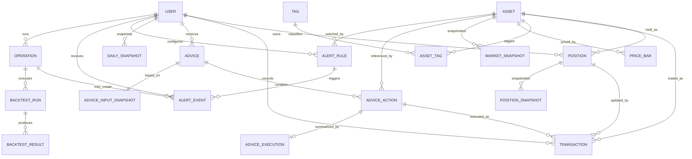

# FAMS Core Data Model ERD

## Purpose

This document defines the minimum data backbone for the trusted investment
ledger loop:

`Asset -> Position -> Advice -> AdviceAction -> Transaction -> Snapshot -> Backtest`

It is intentionally scoped for `V1.0` and `V1.5`. `V2.0` MCP and `V3.0`
orchestration consume this model but do not define it.

## Current Gaps

Current Prisma already contains:

- `Asset`
- `Position`
- `Transaction`
- `Advice`
- `AdviceAction`
- `PriceHistory`
- `DailySnapshot`
- `Alert`
- `Backtest`

Current Prisma is missing or under-modeled:

- explicit `AdviceInputSnapshot`
- explicit `PositionSnapshot`
- explicit `MarketSnapshot`
- `Operation` or `Job`
- `AlertRule` and `AlertEvent`
- explicit execution linkage beyond `Transaction.adviceActionId`
- normalized market quote vs historical price separation

## Target Entity Set

### V1.0 Must Have

- `Asset`
- `Tag`
- `AssetTag`
- `Position`
- `Transaction`
- `Advice`
- `AdviceAction`
- `DailySnapshot`
- `Backtest`

### V1.5 Must Add

- `AdviceInputSnapshot`
- `PositionSnapshot`
- `MarketSnapshot`
- `Operation`
- `AlertRule`
- `AlertEvent`
- `AdviceExecution`

## ERD

## Canonical Entity Responsibilities

### Asset

Represents the tradable or trackable instrument identity.

Keep here:

- `symbol`
- `name`
- `type`
- `currency`
- `exchange`
- optional sector/industry identity

Do not keep here:

- technical indicators
- fund holdings detail
- historical bars
- transient valuation metrics

### Position

Represents current user holding state for one asset.

Core fields:

- `quantity`
- `avgCost`
- `costBasis`
- `currentPrice`
- `marketValue`
- `unrealizedPnl`
- `realizedPnl`
- `status`

Position is the live state. Historical state belongs in `PositionSnapshot`.

### Transaction

Represents the source-of-truth ledger event.

Core fields:

- `type`: `buy | sell | dividend | fee | deposit | withdraw`
- `quantity`
- `price`
- `fee`
- `amount`
- `executedAt`
- `source`: `manual | imported | advice_confirmed`
- `adviceActionId` nullable

Key rule:

- portfolio truth comes from transactions and derived positions, not from AI
  text or page-state calculations

### Advice

Represents one advice batch generated at a specific time for a user and
portfolio context.

Core fields:

- `generatedAt`
- `riskLevel`
- `status`
- `summaryJson`
- `recommendationJson`
- `adviceInputSnapshotId`
- `schemaVersion`

### AdviceAction

Represents each actionable item from one advice batch.

Core fields:

- `actionType`
- `suggestedQuantity`
- `suggestedAmount`
- `suggestedPrice`
- `targetPositionPct`
- `confidence`
- `reason`
- `status`

### AdviceExecution

Summarizes what happened after user review.

Purpose:

- compare original AI suggestion vs user edits vs actual transaction result

Suggested fields:

- `adviceActionId`
- `decision`: `accepted | rejected | modified | expired`
- `overrideJson`
- `executedTransactionIdsJson`
- `executedAt`
- `notes`

### AdviceInputSnapshot

Stores the exact data context used to generate the advice.

Suggested fields:

- `userId`
- `capturedAt`
- `portfolioSnapshotJson`
- `positionSnapshotJson`
- `marketSnapshotJson`
- `constraintsJson`
- `promptVersion`

### PositionSnapshot

Stores a historical frozen view of a position at one timestamp.

Suggested fields:

- `userId`
- `positionId`
- `assetId`
- `capturedAt`
- `quantity`
- `avgCost`
- `marketValue`
- `costBasis`
- `actualWeightPct`
- `costWeightPct`

### MarketSnapshot

Stores point-in-time quote and selected metrics used by analysis and backtest.

Suggested fields:

- `assetId`
- `capturedAt`
- `price`
- `source`
- `confidenceScore`
- `dayChangePct`
- `valuationJson`
- `technicalJson`

### AlertRule

Persistent trigger condition.

Suggested fields:

- `userId`
- `assetId` nullable
- `ruleType`: `price_above | price_below | position_deviation | drawdown | valuation_percentile`
- `thresholdValue`
- `comparisonConfigJson`
- `enabled`
- `lastTriggeredAt`

### AlertEvent

Historical event emitted when rule conditions were met.

Suggested fields:

- `alertRuleId`
- `userId`
- `assetId` nullable
- `triggeredAt`
- `message`
- `severity`
- `status`: `unread | read | dismissed`
- `marketSnapshotId` nullable

### Operation

Tracks async execution lifecycle.

Suggested fields:

- `userId`
- `type`
- `status`
- `requestedAt`
- `startedAt`
- `completedAt`
- `inputJson`
- `resultJson`
- `errorJson`
- `artifactRefsJson`

## Relationship Rules

### Advice To Transaction

- one `Advice` contains many `AdviceAction`
- one `AdviceAction` may produce zero, one, or many `Transaction`
- one `Transaction` may come from zero or one `AdviceAction`

This supports:

- split execution
- partial execution
- edited execution
- rejected suggestions

### Position And Transaction

- `Transaction` is immutable business event
- `Position` is derived live state
- `PositionSnapshot` is frozen historical state

### Alert Rule And Event

- rule is configuration
- event is historical trigger record

Do not overload one alert row to represent both.

## Migration Guidance

### Keep And Evolve

- `Asset`
- `Position`
- `Transaction`
- `Advice`
- `AdviceAction`
- `PriceHistory`
- `DailySnapshot`
- `Backtest`

### Replace Or Split

- `Alert` -> evolve into `AlertRule` + `AlertEvent`
- `DailySnapshot` -> keep for summary, but add explicit `PositionSnapshot` and
  `AdviceInputSnapshot`
- `PriceHistory` -> keep for bars, but add `MarketSnapshot` for point-in-time
  analysis context
- `Suggestion` -> deprecate in favor of `Advice` once structured schema is fully
  adopted

## Phase Mapping

### V1.0

- stabilize `Advice`, `AdviceAction`, `Transaction`
- add `source` and `schemaVersion`-style fields where needed
- define `AlertRule` target model even if not fully migrated yet

### V1.5

- add `AdviceInputSnapshot`
- add `PositionSnapshot`
- add `MarketSnapshot`
- add `Operation`
- split `Alert` into `AlertRule` and `AlertEvent`

### V2.0+

- expose these entities through tool contracts and artifacts
- do not redesign the ledger model for MCP transport concerns
