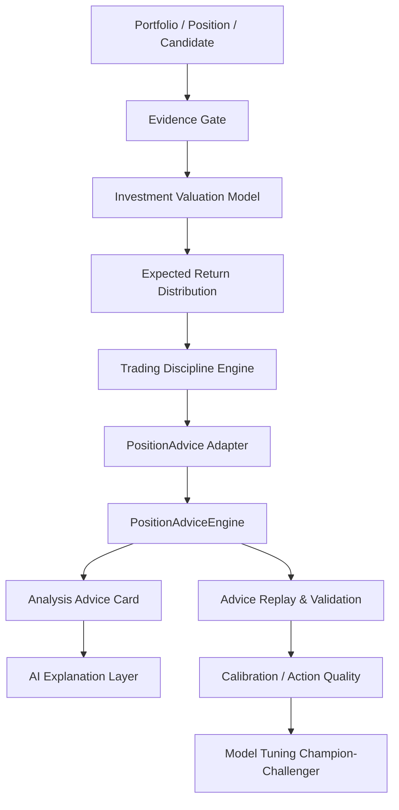

# 模型架构设计：FIVD-R

版本：v0.2  
日期：2026-06-02

---

# 1. 架构总览

FIVD-R，全称：

```text
FAMS Investment Valuation, Discipline & Replay Model
```

它由 8 个模块组成：

```text
1. Evidence Gate
2. Investment Valuation Model
3. Expected Return Distribution Model
4. Trading Discipline Engine
5. PositionAdvice Adapter
6. AI Explanation Layer
7. Advice Replay & Validation Engine
8. Model Tuning & Intervention Layer
```

2026-06-02 补充：Phase 12-15 收口后，FIVD-R 增加三类横切能力：

```text
9. DataGapSummary actionable gap layer
10. Capability State / Trade Gate Contract layer
11. Validation Failure Taxonomy layer
```

总流程：



---

# 2. Evidence Gate

## 2.1 目标

Evidence Gate 判断当前数据是否足以支撑分析建议。

它不做收益预测，只做证据门禁。

## 2.2 输入

```text
assetIdentity
marketDataCoverage
marketFeatureDaily
providerHealth
fundamentalFactSet
newsEventFactSet
strategyEvidence
validationEvidence
portfolioContext
positionContext
```

## 2.3 输出

```ts
type EvidenceGateResult = {
  status: "pass" | "partial" | "blocked"
  evidenceQualityScore: number
  missingData: string[]
  conflictFlags: string[]
  blockedReasons: string[]
  evidenceRefs: string[]
}
```

## 2.4 规则

```text
asset type unknown => blocked
market coverage failed => blocked
latest price stale => partial 或 blocked
provider conflict severe => blocked
fundamental facts missing => valuation partial
validation evidence failed => formal ADD blocked
cash asset => no valuation required
```

## 2.5 DataGapSummary

Evidence Gate 的 broad blockers 必须被转换为可行动数据缺口。

核心结构：

```ts
type DataGap = {
  gapId: string
  assetId?: string
  symbol?: string
  assetName?: string
  assetType: "stock" | "etf" | "fund" | "bond_fund" | "gold" | "cash" | "unknown"
  severity: "blocking" | "degrading" | "optional"
  category:
    | "asset_identity"
    | "market_data"
    | "valuation"
    | "fundamental"
    | "financial_report"
    | "fund_factset"
    | "gold_macro"
    | "validation_evidence"
    | "tradeability"
    | "news_event"
    | "provider_health"
  blockedReason: string
  missingFields: string[]
  requiredFor: Array<"research" | "observe" | "manual_trade_draft" | "formal_trade_action">
  userMessage: string
  developerMessage: string
  suggestedAction: string
  providerCandidates: string[]
  evidenceRefs: string[]
}
```

当前实现入口：

```text
backend/src/services/analysis/dataGapSummaryService.ts
```

已接入：

- portfolio summary
- position detail
- holdings research
- candidate scoring
- manual trade draft blocked response
- validation retest audit response

## 2.6 Capability State 与动作边界

FIVD-R 输出必须显式区分研究状态和交易状态：

```ts
type FivdRCapabilityState =
  | "RESEARCH_READY"
  | "OBSERVE_ONLY"
  | "DATA_INSUFFICIENT"
  | "TRADE_BLOCKED"
  | "SYSTEM_UNAVAILABLE"
```

所有 FIVD-R 主输出应包含：

```ts
capabilityState: FivdRCapabilityState
researchAvailable: boolean
observeAllowed: boolean
formalTradeActionAllowed: boolean
manualTradeDraftAllowed: boolean
autoTradeAllowed: false
```

硬规则：

```text
validation_evidence failed => formalTradeActionAllowed=false
validation_evidence failed => manualTradeDraftAllowed=false
AUTO_TRADE 永远 false
```

禁止动作统一由：

```text
backend/src/services/analysis/fivdRProhibitedActions.ts
```

推导，避免不同路径重复定义 gate 逻辑。

---

# 3. Investment Valuation Model

## 3.1 输入类型

```ts
type InvestmentValuationInput = {
  runContext: {
    runId: string
    valuationDate: string
    modelVersion: string
    dataVersion: string
    requestedBy: "user" | "operation" | "agent"
    purpose: "holding_review" | "new_candidate" | "rebalance" | "risk_review"
  }

  portfolioContext: {
    totalMarketValue: number
    cashRatio: number
    riskPreference: "conservative" | "balanced" | "aggressive"
    buckets: Array<{
      bucket: "core" | "satellite" | "cash"
      currentWeight: number
      targetWeightRange: [number, number]
      maxDrawdownTolerance: number
      maxSinglePositionWeight: number
    }>
  }

  positionContext?: {
    assetId: string
    bucket: "core" | "satellite"
    currentWeight: number
    marketValue: number
    costBasis: number
    currentPrice: number
    unrealizedPnl: number
    unrealizedPnlPct: number
    holdingDays: number
    stopProfitPct?: number
    stopLossPct?: number
  }

  assetIdentity: {
    assetId: string
    symbol: string
    name: string
    assetType: "stock" | "etf" | "fund" | "bond_fund" | "gold" | "cash"
    market?: string
    exchange?: string
    industry?: string
    themeTags?: string[]
  }

  marketData: {
    latestPrice: number
    priceTime: string
    coverageStatus: "sufficient" | "partial" | "stale" | "failed" | "unknown"
    providerConfidence: number
    features?: unknown
    warnings: string[]
    evidenceRefs: string[]
  }

  fundamentals?: unknown
  etfFacts?: unknown
  fundFacts?: unknown
  bondFacts?: unknown
  goldMacroFacts?: unknown
  newsEvents?: unknown
  transactionHistory?: unknown[]
  strategyEvidence?: unknown[]
}
```

---

# 4. InvestmentValuationOutput

```ts
type InvestmentValuationOutput = {
  runId: string
  assetId: string
  modelVersion: string
  dataVersion: string
  valuationDate: string

  status: "available" | "partial" | "insufficient" | "blocked"

  thesisType:
    | "core_holding"
    | "satellite_opportunity"
    | "trading_candidate"
    | "watchlist"
    | "reduce_risk"
    | "avoid"
    | "cash_no_action"
    | "data_insufficient"

  scores: {
    valuationScore: number
    qualityScore: number
    growthScore: number
    financialRiskScore: number
    timingScore: number
    portfolioFitScore: number
    evidenceQualityScore: number
    compositeScore: number
  }

  valuation: {
    method: string[]
    label: "undervalued" | "fair" | "overvalued" | "unknown"
    fairValueRange?: [number, number]
    currentPrice?: number
    marginOfSafety?: number
    historicalPercentile?: number
    peerPercentile?: number
    confidence: "high" | "medium" | "low" | "insufficient"
    reasons: string[]
    warnings: string[]
  }

  expectedReturnDistribution: ExpectedReturnDistribution[]

  tradingDiscipline: TradingDiscipline

  positionAdviceImpact: {
    targetWeightMultiplier: number
    confidenceMultiplier: number
    riskPenaltyMultiplier: number
    blockedReasons: string[]
    allowedActionHints: Array<"ADD" | "REDUCE" | "HOLD" | "OBSERVE" | "NO_ACTION">
    formalTradeActionAllowed: boolean
  }

  evidenceRefs: string[]
  blockedReasons: string[]
  missingData: string[]
  conflictFlags: string[]

  explanationDraft: {
    summary: string
    keyReasons: string[]
    keyRisks: string[]
    nextReviewTriggers: string[]
  }
}
```

---

# 5. 分数体系

所有分数为 0-100。

```text
valuationScore          高 = 估值越有吸引力
qualityScore            高 = 资产质量越高
growthScore             高 = 成长性越强
financialRiskScore      高 = 风险越高，负向分
timingScore             高 = 当前交易时机越好
portfolioFitScore       高 = 越适合当前组合
evidenceQualityScore    高 = 证据越充分
```

股票默认权重：

```text
资产质量 25%
估值吸引力 20%
成长性 20%
风险控制 15%
技术时机 10%
组合适配 10%
```

公式：

```ts
compositeScore =
  qualityScore * 0.25
  + valuationScore * 0.20
  + growthScore * 0.20
  + (100 - financialRiskScore) * 0.15
  + timingScore * 0.10
  + portfolioFitScore * 0.10
```

再乘以证据折扣：

```text
high: 1.0
medium: 0.8
low: 0.5
insufficient: 0.0 - 0.3
```

---

# 6. 资产类型模型

## 6.1 股票模型

模块：

```text
RelativeValuation
FundamentalQuality
GrowthQuality
FinancialRisk
TechnicalTiming
PortfolioFit
```

指标：

```text
PE / PB / PS / PEG
历史估值分位
行业估值分位
ROE
毛利率
净利率
经营现金流 / 净利润
资产负债率
营收增速
扣非净利润增速
trendScore
momentumScore
relativeStrength
volatility
liquidity
```

## 6.2 ETF 模型

模块：

```text
UnderlyingIndexQuality
IndexValuationPercentile
IndexStructureRisk
TrackingAndFee
Liquidity
PortfolioFit
```

指标：

```text
指数 PE / PB 分位
指数 ROE
股息率
行业集中度
前十大权重
规模
成交额
费率
跟踪误差
溢价率 / 折价率
```

## 6.3 主动基金模型

模块：

```text
ManagerSkill
StyleConsistency
DrawdownControl
ExcessReturnStability
FeeEfficiency
PortfolioFit
```

## 6.4 债基模型

模块：

```text
DurationRisk
CreditRisk
YieldCompensation
DrawdownControl
LiquidityRisk
IssuerConcentration
```

## 6.5 黄金模型

黄金没有现金流，不使用股票估值模型。

模块：

```text
RealRateRegime
DollarRegime
InflationExpectation
SafeHavenDemand
CentralBankBuying
PortfolioHedgeValue
TechnicalTiming
```

## 6.6 现金模型

现金不生成投资建议。

输出：

```text
cash_no_action
liquidity buffer
opportunity cost
```

---

# 7. Expected Return Distribution

## 7.1 目标

输出未来不同期限的收益概率分布，而不是单点预测。

## 7.2 类型

```ts
type ExpectedReturnDistribution = {
  horizon: "20d" | "60d" | "120d" | "1y"
  expectedReturnPct: number
  expectedPnlAmount: number
  probabilityOfGain: number
  probabilityOfLoss: number
  probabilityOfStopLoss?: number
  probabilityOfTakeProfit?: number
  p05: number
  p25: number
  p50: number
  p75: number
  p95: number
  expectedMaxDrawdown: number
  cvar5?: number
  method: string[]
  sampleSize: number
  confidence: "high" | "medium" | "low" | "insufficient"
}
```

## 7.3 分布来源

```text
historical_bootstrap
strategy_backtest_distribution
regime_matched_samples
fundamental_scenario
volatility_model
```

---

# 8. Trading Discipline Engine

## 8.1 类型

```ts
type TradingDiscipline = {
  bucket: "core" | "satellite" | "cash"
  disciplineType:
    | "accumulate_on_dip"
    | "hold_with_review"
    | "trim_on_strength"
    | "risk_reduce"
    | "watch_only"
    | "avoid"
    | "no_action"

  validFrom: string
  validUntil: string
  reviewCadence: "daily" | "weekly" | "monthly" | "quarterly"

  maxAllowedWeight?: number
  targetWeightMultiplier: number

  addConditions: string[]
  reduceConditions: string[]
  stopConditions: string[]
  takeProfitConditions: string[]
  invalidationConditions: string[]

  humanConfirmationRequired: boolean
}
```

## 8.2 核心仓规则

```text
低换手
重视基本面
重视估值安全边际
最大回撤约束严格
证据不足时不能进入核心仓
预计最大回撤超过预算时不能提高核心仓
```

## 8.3 卫星仓规则

```text
允许更高波动
必须有有效期
必须有止损条件
必须有止盈条件
必须有催化剂或技术触发
不能无限期持有
```

---

# 9. PositionAdvice Adapter

升级目标仓位公式：

```text
targetWeight =
  baseTargetWeight
  * bucketPolicyMultiplier
  * valuationMultiplier
  * qualityGrowthMultiplier
  * marketRegimeMultiplier
  * timingMultiplier
  * riskPenaltyMultiplier
  * portfolioFitMultiplier
  * evidenceConfidenceMultiplier
  * validationGateMultiplier
```

## 9.1 valuationMultiplier

```text
valuationScore >= 80: 1.20 - 1.40
60 - 79: 1.00 - 1.20
40 - 59: 0.70 - 1.00
20 - 39: 0.30 - 0.70
< 20: 0.00 - 0.30
```

## 9.2 evidenceConfidenceMultiplier

```text
high: 1.00
medium: 0.70
low: 0.30
insufficient: 0.00
```

## 9.3 validationGateMultiplier

```text
passed: 1.00
partial: 0.50
failed: formal ADD blocked
unknown: formal ADD blocked
```

---

# 10. Advice Replay & Validation Engine

## 10.1 目标

验证分析建议体系是否真的改善组合结果。

验证对象：

```text
价值评分
仓位建议
交易纪律
概率分布
门禁规则
人工干预
模型参数
```

## 10.2 Replay 类型

```text
Fixed Start Replay:
  3 个月前
  2 个月前
  1 个月前

Rolling Start Replay:
  最近半年每周作为起点
```

## 10.3 Replay 模式

```text
Gate-Strict:
  严格遵守 Validation Gate，未通过不执行 formal ADD / REDUCE。

Research-Only:
  记录理论动作，但不能作为正式交易建议。

Buy & Hold:
  原持仓不动。

Benchmark:
  指数基准。
```

## 10.4 每周流程

```text
1. 读取 reviewDate 当时可见数据。
2. 运行 InvestmentValuationModel。
3. 运行 PositionAdviceEngine。
4. 运行 TradingDisciplineEngine。
5. 运行 Validation Gate。
6. 生成模拟交易计划。
7. T+1 成交。
8. 扣手续费、印花税、滑点。
9. 更新虚拟组合。
10. 记录 decision log / trade log / portfolio snapshot。
```

禁止未来函数：

```text
不能用未来 K 线。
不能用未来财报。
不能用未来新闻。
不能用未来交易状态修正历史判断。
```

---

# 11. Calibration & Tuning

## 11.1 动作质量

```text
ADD 后收益
REDUCE 后避损
HOLD 后收益
OBSERVE 机会成本
AVOID 避免亏损
```

## 11.2 概率校准

```text
gainProbabilityCalibration
p05_p95_coverage
p25_p75_coverage
stopLossProbabilityError
takeProfitProbabilityError
expectedReturnError
drawdownUnderestimateRate
```

## 11.3 Champion / Challenger

```text
Champion: 当前线上模型
Challenger: 待验证新参数模型
```

Challenger 必须通过 replay validation，才能人工 promote。

---

# 12. AI Explanation Layer

AI 只解释结构化结果，不新增交易结论。

允许解释：

```text
为什么 valuationScore 是这个分数
为什么不能输出正式交易建议
哪些数据缺失
哪些条件触发后需要复核
为什么当前只建议观察
```

禁止：

```text
绕过 Validation Gate
编造 evidenceRefs
自行生成买入/卖出指令
把 Research-Only 说成正式建议
```

---

# 13. Candidate Scoring 语义

2026-06-02 起，候选 FIVD-R scoring 不再只展示单一 `totalScore`。

候选分数拆为：

```ts
type FivdRCandidateScore = {
  signalScore: number
  researchScore: number
  evidenceAdjustedScore: number
}
```

含义：

- `signalScore`：来自策略选股/技术信号的原始线索强度。
- `researchScore`：FIVD-R 对 valuation、expected return、risk、market state、evidence quality 的研究评分。
- `evidenceAdjustedScore`：在资产身份、validation evidence、数据完整性和可交易性折扣后的默认排序分。

前端默认按 `evidenceAdjustedScore desc` 排序。

如果存在 `asset_identity_missing`：

- disposition 必须为 `needs_more_evidence`。
- 只能作为研究线索。
- 不允许进入 observe/action-ready。
- 不允许输出 `ADD / REDUCE / AUTO_TRADE`。

如果 `validation_evidence` 未通过：

- candidate 可以 `RESEARCH / OBSERVE / SNAPSHOT / WATCH / RISK_ALERT`。
- candidate 禁止 `ADD / REDUCE / AUTO_TRADE`。

---

# 14. Validation Failure Taxonomy

FIVD-R validation retest 输出独立失败归因：

```text
schemaVersion = fivd.r.validation_failure_taxonomy.v1
```

生成入口：

```text
POST /api/v1/analysis/fivd-r/validation-retest
GET  /api/v1/analysis/fivd-r/validation-report/latest
```

artifact：

```text
validation_failure_taxonomy.json
```

核心结构：

```ts
type FivdRValidationFailureTaxonomy = {
  status: "blocked_for_trading" | "needs_more_samples" | "ready_for_manual_review"
  summary: {
    passedCandidates: number
    failedCandidates: number
    insufficientCandidates: number
    diagnosedCandidates: number
    tradeActionAllowed: false
    manualTradeDraftAllowed: false
    autoTradeAllowed: false
    blocker?: string | null
  }
  failureCategories: Array<{
    category:
      | "validation_evidence"
      | "out_of_sample"
      | "parameter_sensitivity"
      | "market_regime"
      | "sample_size"
      | "candidate_quality"
      | "data_quality"
    severity: "critical" | "major" | "minor"
    explanation: string
    nextAction: string
    evidenceRefs: string[]
  }>
  recommendation:
    | "keep_research_only"
    | "narrow_strategy_scope"
    | "retest_with_longer_window"
    | "retire_strategy"
    | "requires_new_strategy_family"
  prohibitedActions: ["ADD", "REDUCE", "AUTO_TRADE"]
}
```

当前真实本地验证输出的主要失败类：

- `validation_evidence`：critical
- `out_of_sample`：critical
- `parameter_sensitivity`：critical
- `market_regime`：major
- `sample_size`：major

该 taxonomy 只解释为什么不能交易，不放行交易动作。
